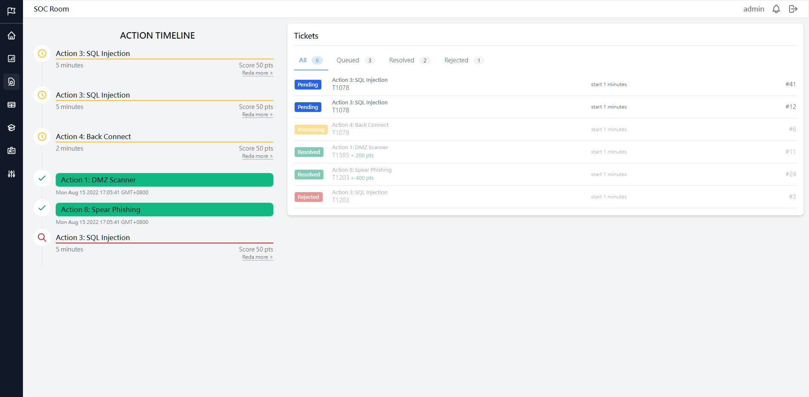
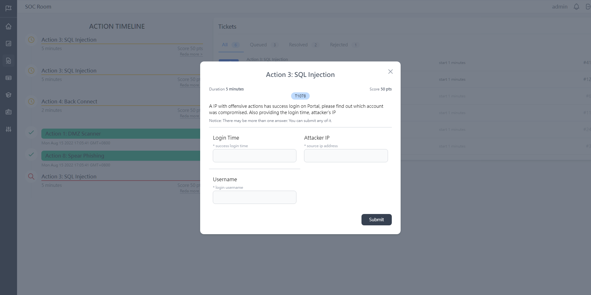

# Trapa Security F2e Frontend Engineer Test
### _Demo Test_

## Image
[Image Resource](https://www.flaticon.com/free-icons/robot) by Robot icons created by Freepik - Flaticon

## Tech
- Vite
- Vue3 建置模板
- Vue-router 基本路由配置
    * /Info
- TailwindCss 美觀

## Features
- 基本情境展示





## Installation
Dillinger requires [Node.js](https://nodejs.org/) v10+ to run.

Install the dependencies and devDependencies and start the server.

```sh
cd trapa_security_f2e_Test
yarn install
yarn dev
```
